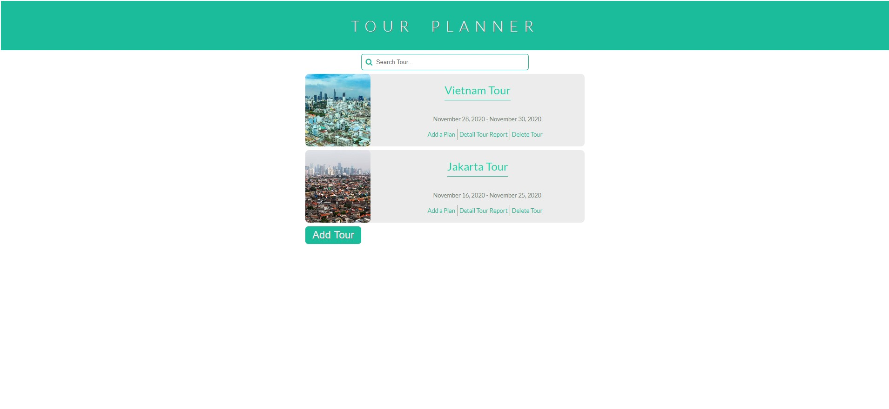

# <h1 align="center"> 👋Welcome to the Tour Planner 👋 </h1>
Logging Tour details and plans.  

This app is for saving tours, it's corresponding plans and generating PDF of the respective tour. 

## View
It has 3 main pages-
+ Index Page: Here you can see all of your tours and perform certain actions on tour.
+ Add Tour Page: From here you can add new tour. 
+ Add Plan Page: You can add specific plan under each tour. 

Here's how they look 😎

## Demo
Due to firestore data limitation and security issue, I can't give the live URL here. But here's the video->

<a href="https://drive.google.com/file/d/1saL63NtEfIggNHDYhf67enWF13iAf7fE/view?usp=sharing">Video Demonstration</a>

## Tech I Used
+ HTML/CSS (No preprocessor or anything).
+ Vanilla Js
+ Firestore to store data
+ Momentjs for date/time
+ Webpack to bundle my Js
+ html2pdf plugin to generate PDF

## Disclaimer
There are still lots of room for improvement. But each and every project has certain scope, budget and timeline. Under these constraint my project is done for me. But one can contribute and add extra functionlities

